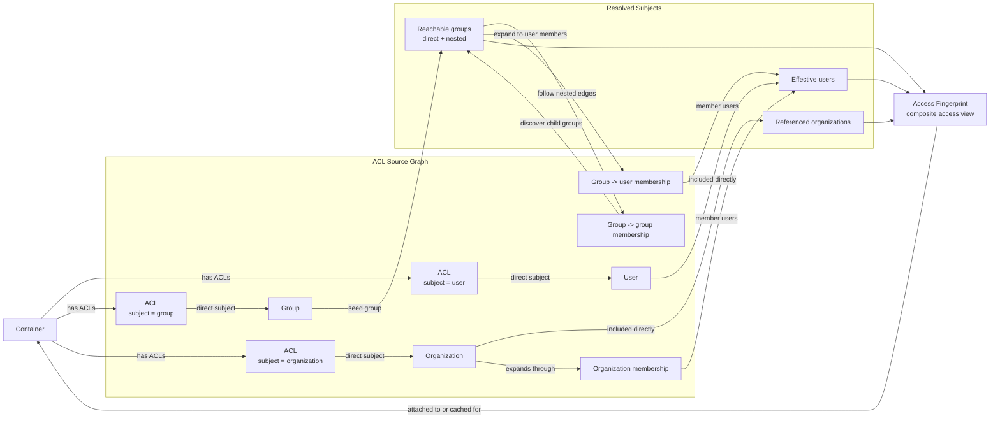

# Access Fingerprint

An access fingerprint is a composite access view for a container.

It starts from the container's ACL entries, follows those ACL subject links to
users, groups, and organizations, and then expands group and organization
membership into the effective set of users who currently reach the container.

To support nested groups, the source graph includes both `group -> user`
membership and `group -> group` membership, and group expansion is transitive.

This is meant as an authorization-side composite, not a single user's crypto
key fingerprint.

In that model, the access fingerprint answers:

- which users have effective access right now
- which groups and organizations contributed to that access
- which nested groups were reached transitively from an ACL-linked group
- which ACL edges explain why the container is reachable
