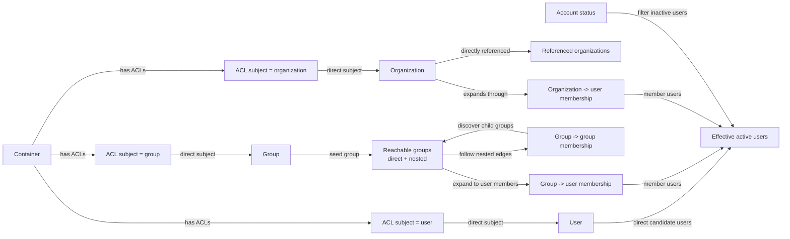
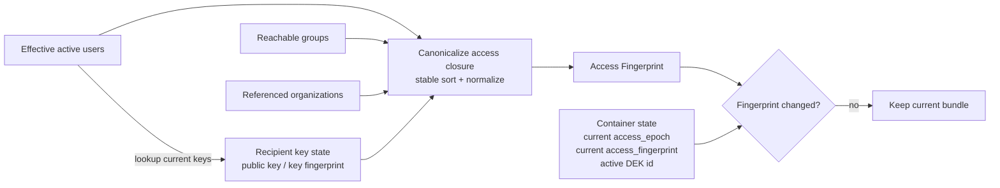
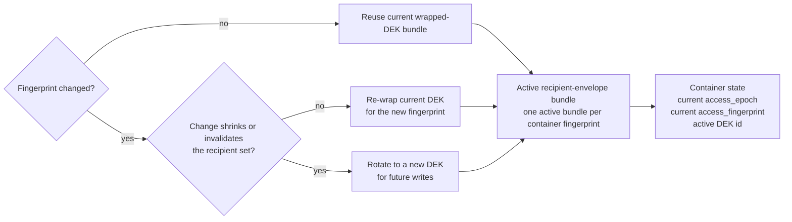

# Access Fingerprint

An access fingerprint is a composite access view for a container.

It starts from the container's ACL entries, follows those ACL subject links to
users, groups, and organizations, and then expands group and organization
membership into the effective set of users who currently reach the container.

To support nested groups, the source graph includes both `group -> user`
membership and `group -> group` membership, and group expansion is transitive.

This is meant as an authorization-side composite, not a single user's crypto
key fingerprint.

> Key idea
>
> Each container has one active wrapped-DEK bundle for its current access
> fingerprint. When the fingerprint changes, that bundle is stale.

Operationally, the fingerprint is derived from the fully expanded access
closure plus recipient validity inputs such as account status and current
recipient key identity.

Important limitation:

The fingerprint is not itself proof that the access closure was authorized.

If the underlying ACL or group membership inputs come only from mutable API
state, a malicious or compromised API can produce a self-consistent but
unauthorized fingerprint. In zero-trust mode, the closure inputs must therefore
be signed and versioned outside the API's unilateral control.

## 1. Resolve Effective Access

This section answers: who currently reaches the container?

> Note
>
> Nested groups are resolved transitively. The result is the effective active
> user set plus the contributing groups and organizations.

## 2. Derive The Fingerprint

This section answers: does the container's current wrapped-key bundle still
match the current access closure?

> Callout
>
> The access fingerprint is the single cache key for the container's active
> wrapped-DEK bundle.

In zero-trust mode, the canonicalization input should include verified policy
state identifiers, not just the expanded recipient list. For example:

- object ACL entries or ACL hash
- referenced group ids plus signed versions or state hashes
- referenced organization ids plus signed versions or state hashes
- effective active users
- recipient key fingerprints

That way the fingerprint changes not only when recipients change, but also when
the signed policy state used to justify those recipients changes.

## 3. Materialize Or Invalidate The Wrapped-DEK Bundle

This section answers: when the fingerprint changes, can future writes keep the
same DEK or must they move to a new one?

## 4. Invalidation Rules

- Additive access changes can usually keep the current DEK and only re-wrap it for the new fingerprint.
- Removal, deactivation, or compromise should rotate to a new DEK for future writes.
- Any fingerprint change should bump the container's access epoch so stale writes can be rejected.

In this model, the access fingerprint answers:

- which users have effective access right now
- which groups and organizations contributed to that access
- which nested groups were reached transitively from an ACL-linked group
- whether the container's current wrapped-DEK bundle is still valid
- whether the next bundle can reuse the current DEK or must rotate to a new one

In zero-trust mode it should additionally answer:

- which signed group or organization states justified that access
- whether the API is presenting policy state that matches trusted signatures
