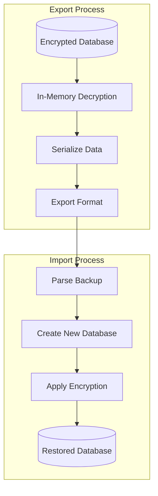
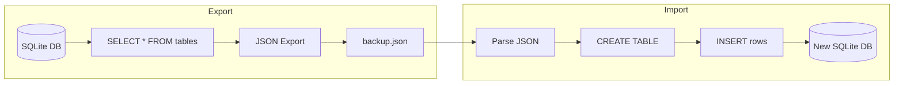
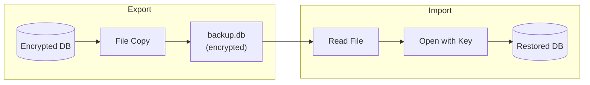
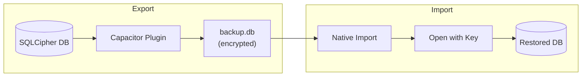

# Backup and Restore Architecture

Rapid provides backup and restore functionality to protect your data. Due to platform-specific constraints with encrypted SQLite databases, the backup format and process varies by platform.

## Overview



## Web (Browser/WASM)

### The Challenge

SQLite3MultipleCiphers WASM has specific limitations that affect backup/restore:

1. **`sqlite3_js_db_export()` returns UNENCRYPTED data** - The function serializes in-memory (decrypted) database pages, not the encrypted file on disk
2. **`sqlite3_deserialize()` does NOT work** - Returns `SQLITE_NOTADB` error with this WASM build
3. **Emscripten FS not available** - The virtual filesystem isn't exposed

### Solution: JSON-Based Backup



### Export Format

```json
{
  "version": 1,
  "tables": [
    { "name": "contacts", "sql": "CREATE TABLE contacts (...)" },
    { "name": "files", "sql": "CREATE TABLE files (...)" }
  ],
  "indexes": [
    { "name": "idx_contacts_email", "sql": "CREATE INDEX ..." }
  ],
  "data": {
    "contacts": [
      { "id": 1, "name": "John", "email": "john@example.com" },
      { "id": 2, "name": "Jane", "email": "jane@example.com" }
    ],
    "files": [...]
  }
}
```

### Web Security Considerations

- **Backup files are NOT encrypted** - The JSON export contains plaintext data
- **User responsibility** - Users should store backup files securely
- **Re-encryption on import** - Data is re-encrypted when imported into a new database
- **No key material in backup** - Encryption keys are never included in backups

## Electron (Desktop)

Desktop uses native SQLite with better-sqlite3-multiple-ciphers, which supports standard SQLite backup mechanisms.



### Electron Security Considerations

- **Backup files ARE encrypted** - The backup is a copy of the encrypted database file
- **Same encryption key required** - Must use the same password to restore
- **File-level encryption preserved** - All encryption is maintained in the backup

## iOS and Android (Capacitor)

Mobile platforms use SQLCipher through Capacitor plugins.



### Mobile Security Considerations

- **Backup files ARE encrypted** - Uses SQLCipher's native encryption
- **Same encryption key required** - Must use the same password to restore
- **Native file handling** - Uses platform-specific file APIs

## Platform Comparison

| Feature | Web (WASM) | Electron | iOS/Android |
| ------- | ---------- | -------- | ----------- |
| Backup Format | JSON (plaintext) | Binary (encrypted) | Binary (encrypted) |
| Encryption in Backup | No | Yes | Yes |
| Cross-Platform Restore | Yes | No | No |
| File Extension | `.json` | `.db` | `.db` |
| Backup Size | Larger (text) | Smaller (binary) | Smaller (binary) |

## API Usage

### WasmNodeAdapter (Web/Testing)

```typescript
// Export to JSON
const jsonBackup = await adapter.exportDatabaseAsJson();

// Import from JSON
await adapter.importDatabaseFromJson(jsonBackup, encryptionKey);
```

### ElectronAdapter (Desktop)

```typescript
// Export (file copy)
const bytes = await adapter.exportDatabase();

// Import
await adapter.importDatabase(bytes, encryptionKey);
```

## Known Limitations

### Web Platform

- `sqlite3_deserialize()` returns `SQLITE_NOTADB` error
- Binary import not supported - must use JSON format
- Backups are larger due to JSON text encoding

### All Platforms

- Large databases may have performance issues during export
- BLOB data is base64 encoded in JSON backups (increases size)
- Concurrent modifications during backup may cause inconsistencies

## Best Practices

1. **Close database before backup** - Ensures data consistency
2. **Store backups securely** - Especially for plaintext JSON backups
3. **Test restore periodically** - Verify backups are valid
4. **Include backup in routine** - Regular backups protect against data loss
5. **Keep encryption password safe** - Cannot restore without it (for encrypted backups)
