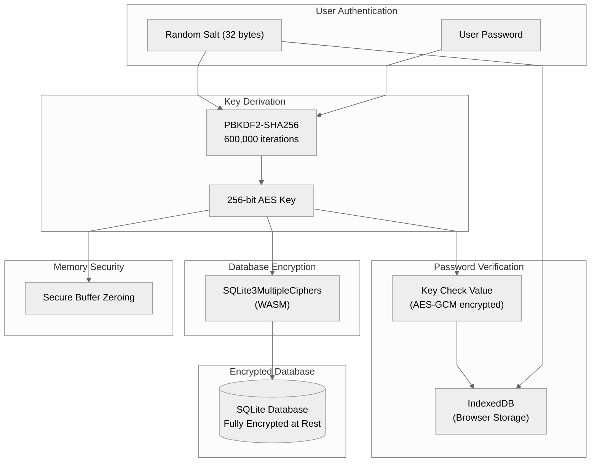
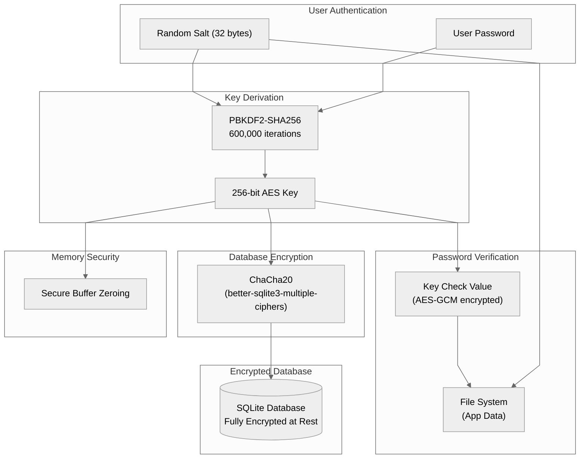
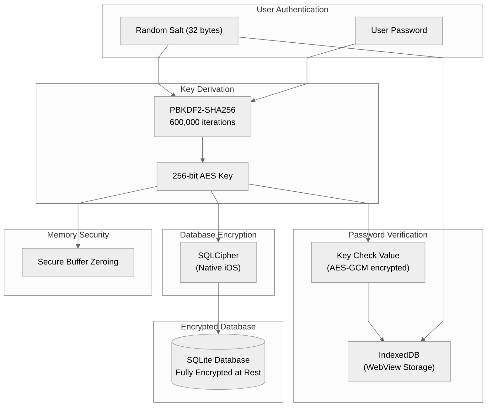

# Database Encryption Architecture

## Web (Browser)

## Electron (Desktop)

## iOS

## Android

## Platform Reference

| Platform | Encryption Library                         | Salt/KCV Storage    |
| -------- | ------------------------------------------ | ------------------- |
| Web      | SQLite3MultipleCiphers (WASM)              | IndexedDB           |
| Electron | ChaCha20 (better-sqlite3-multiple-ciphers) | File System         |
| iOS      | SQLCipher                                  | IndexedDB (WebView) |
| Android  | SQLCipher                                  | IndexedDB (WebView) |
