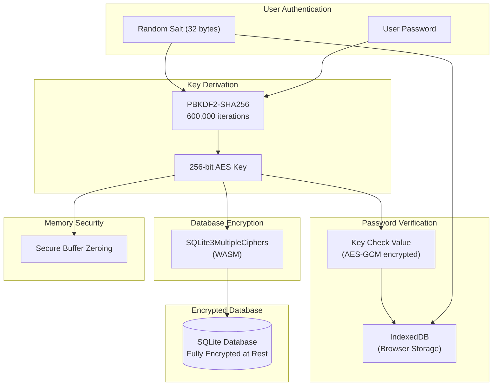
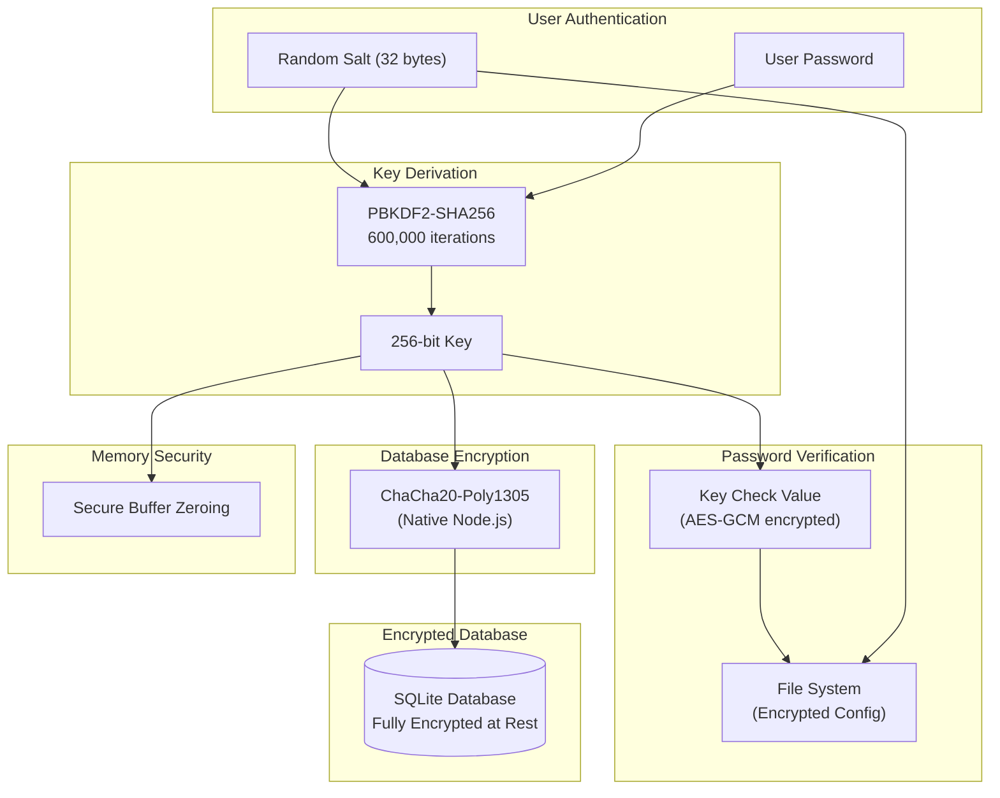
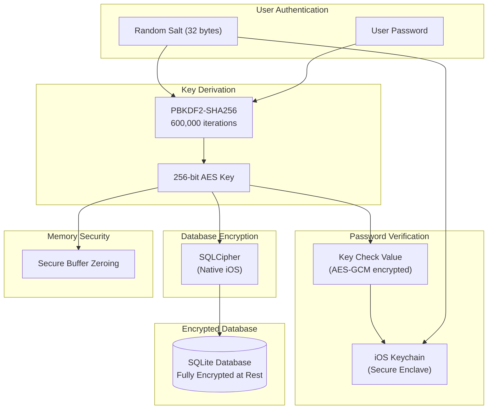
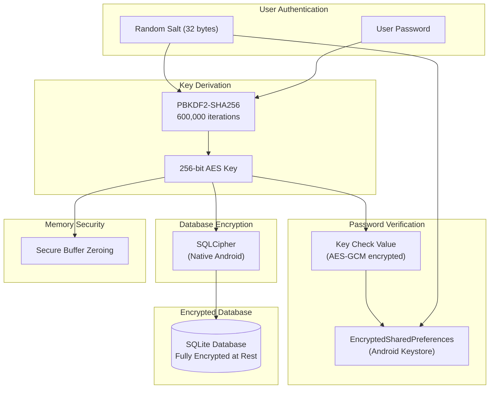

# Database Encryption Architecture

Rapid uses industry-standard encryption to protect your data at rest. Your password never leaves your device - instead, it's used to derive a 256-bit encryption key using PBKDF2 with 600,000 iterations. This key encrypts your entire SQLite database using platform-native encryption libraries.

## Web (Browser)

## Electron (Desktop)

## iOS

## Android

## Key Components

### Key Derivation

PBKDF2-SHA256 with 600,000 iterations transforms your password into a cryptographically secure 256-bit key, following OWASP 2023 recommendations.

### Platform Security

Each platform uses native encryption:

| Platform | Encryption Library              | Secure Storage              |
| -------- | ------------------------------- | --------------------------- |
| Web      | SQLite3MultipleCiphers (WASM)   | IndexedDB                   |
| Electron | ChaCha20-Poly1305               | File System                 |
| iOS      | SQLCipher                       | Keychain (Secure Enclave)   |
| Android  | SQLCipher                       | EncryptedSharedPreferences  |

### Memory Safety

Encryption keys are securely zeroed from memory after use, preventing extraction from memory dumps or swap files.
