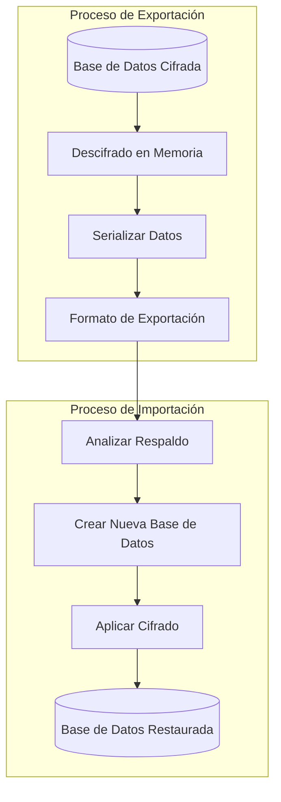
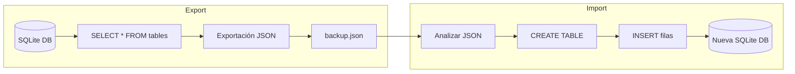
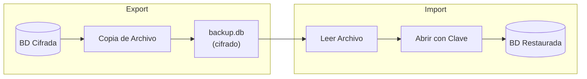
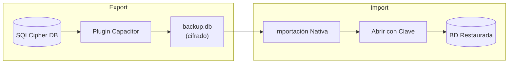

# Arquitectura de Respaldo y Restauración

Rapid proporciona funcionalidad de respaldo y restauración para proteger sus datos. Debido a restricciones específicas de la plataforma con bases de datos SQLite cifradas, el formato de respaldo y el proceso varían según la plataforma.

## Resumen



## Web (Navegador/WASM)

### El Desafío

SQLite3MultipleCiphers WASM tiene limitaciones específicas que afectan el respaldo/restauración:

1. **`sqlite3_js_db_export()` devuelve datos NO CIFRADOS** - La función serializa páginas de base de datos en memoria (descifradas), no el archivo cifrado en disco
2. **`sqlite3_deserialize()` NO funciona** - Devuelve error `SQLITE_NOTADB` con esta compilación WASM
3. **Emscripten FS no disponible** - El sistema de archivos virtual no está expuesto

### Solución: Respaldo Basado en JSON



### Formato de Exportación

```json
{
  "version": 1,
  "tables": [
    { "name": "contacts", "sql": "CREATE TABLE contacts (...)" },
    { "name": "files", "sql": "CREATE TABLE files (...)" }
  ],
  "indexes": [
    { "name": "idx_contacts_email", "sql": "CREATE INDEX ..." }
  ],
  "data": {
    "contacts": [
      { "id": 1, "name": "John", "email": "john@example.com" },
      { "id": 2, "name": "Jane", "email": "jane@example.com" }
    ],
    "files": [...]
  }
}
```

### Consideraciones de Seguridad Web

- **Los archivos de respaldo NO están cifrados** - La exportación JSON contiene datos en texto plano
- **Responsabilidad del usuario** - Los usuarios deben almacenar los archivos de respaldo de forma segura
- **Re-cifrado en importación** - Los datos se vuelven a cifrar cuando se importan a una nueva base de datos
- **Sin material de clave en el respaldo** - Las claves de cifrado nunca se incluyen en los respaldos

## Electron (Escritorio)

El escritorio utiliza SQLite nativo con better-sqlite3-multiple-ciphers, que soporta mecanismos de respaldo estándar de SQLite.



### Consideraciones de Seguridad en Electron

- **Los archivos de respaldo ESTÁN cifrados** - El respaldo es una copia del archivo de base de datos cifrado
- **Se requiere la misma clave de cifrado** - Debe usar la misma contraseña para restaurar
- **Cifrado a nivel de archivo preservado** - Todo el cifrado se mantiene en el respaldo

## iOS y Android (Capacitor)

Las plataformas móviles utilizan SQLCipher a través de plugins de Capacitor.



### Consideraciones de Seguridad Móvil

- **Los archivos de respaldo ESTÁN cifrados** - Utiliza el cifrado nativo de SQLCipher
- **Se requiere la misma clave de cifrado** - Debe usar la misma contraseña para restaurar
- **Manejo de archivos nativo** - Utiliza APIs de archivos específicas de la plataforma

## Comparación de Plataformas

| Característica | Web (WASM) | Electron | iOS/Android |
| -------------- | ---------- | -------- | ----------- |
| Formato de Respaldo | JSON (texto plano) | Binario (cifrado) | Binario (cifrado) |
| Cifrado en Respaldo | No | Sí | Sí |
| Restauración Multiplataforma | Sí | No | No |
| Extensión de Archivo | `.json` | `.db` | `.db` |
| Tamaño de Respaldo | Mayor (texto) | Menor (binario) | Menor (binario) |

## Uso de la API

### WasmNodeAdapter (Web/Pruebas)

```typescript
// Exportar a JSON
const jsonBackup = await adapter.exportDatabaseAsJson();

// Importar desde JSON
await adapter.importDatabaseFromJson(jsonBackup, encryptionKey);
```

### ElectronAdapter (Escritorio)

```typescript
// Exportar (copia de archivo)
const bytes = await adapter.exportDatabase();

// Importar
await adapter.importDatabase(bytes, encryptionKey);
```

## Limitaciones Conocidas

### Plataforma Web

- `sqlite3_deserialize()` devuelve error `SQLITE_NOTADB`
- Importación binaria no soportada - debe usar formato JSON
- Los respaldos son más grandes debido a la codificación de texto JSON

### Todas las Plataformas

- Las bases de datos grandes pueden tener problemas de rendimiento durante la exportación
- Los datos BLOB se codifican en base64 en respaldos JSON (aumenta el tamaño)
- Las modificaciones concurrentes durante el respaldo pueden causar inconsistencias

## Mejores Prácticas

1. **Cerrar la base de datos antes del respaldo** - Asegura la consistencia de datos
2. **Almacenar respaldos de forma segura** - Especialmente para respaldos JSON en texto plano
3. **Probar la restauración periódicamente** - Verificar que los respaldos sean válidos
4. **Incluir respaldo en la rutina** - Los respaldos regulares protegen contra la pérdida de datos
5. **Mantener la contraseña de cifrado segura** - No se puede restaurar sin ella (para respaldos cifrados)
