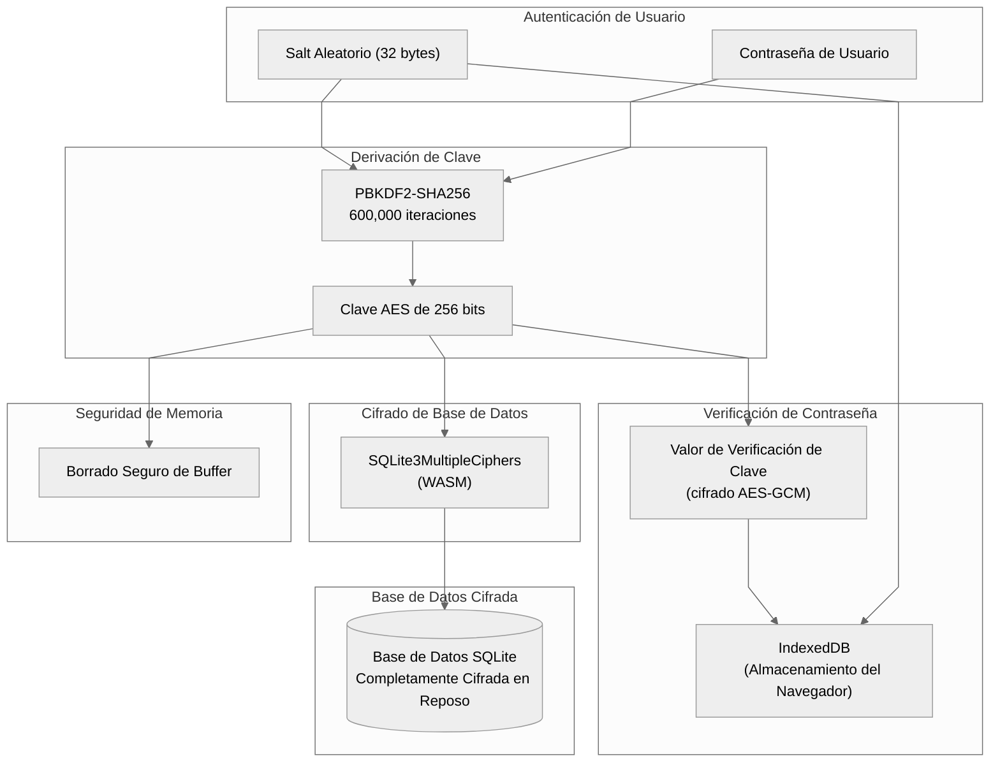
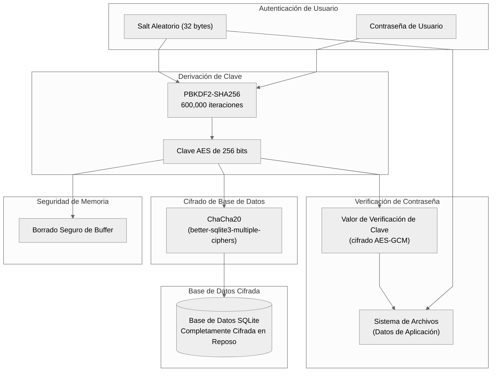
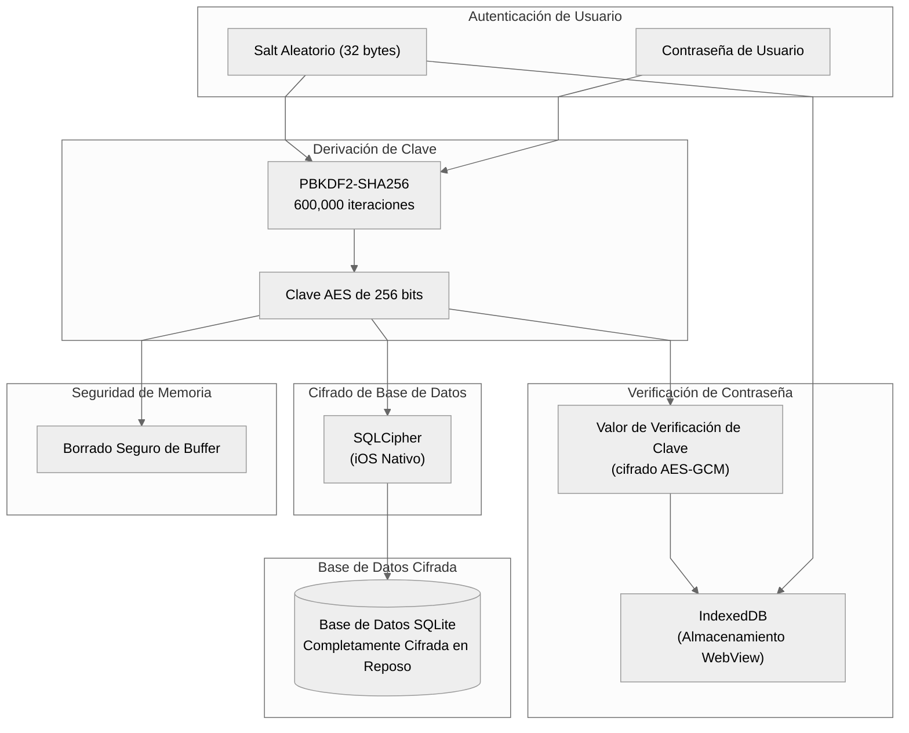
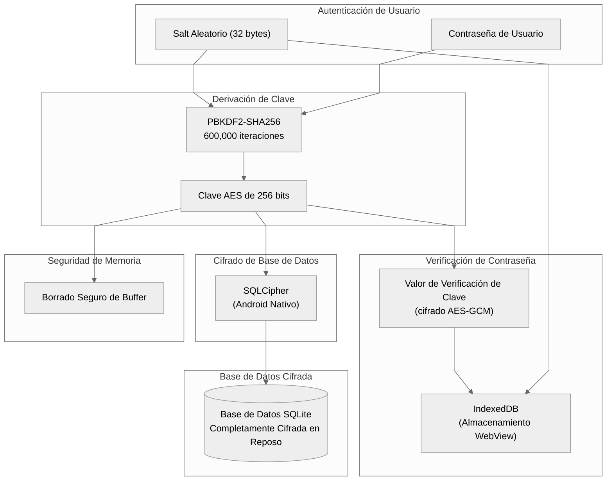

# Arquitectura de Cifrado de Base de Datos

## Web (Navegador)

## Electron (Escritorio)

## iOS

## Android

## Referencia de Plataformas

| Plataforma | Biblioteca de Cifrado | Almacenamiento Salt/KCV |
| ---------- | --------------------- | ----------------------- |
| Web | SQLite3MultipleCiphers (WASM) | IndexedDB |
| Electron | ChaCha20 (better-sqlite3-multiple-ciphers) | Sistema de Archivos |
| iOS | SQLCipher | IndexedDB (WebView) |
| Android | SQLCipher | IndexedDB (WebView) |
