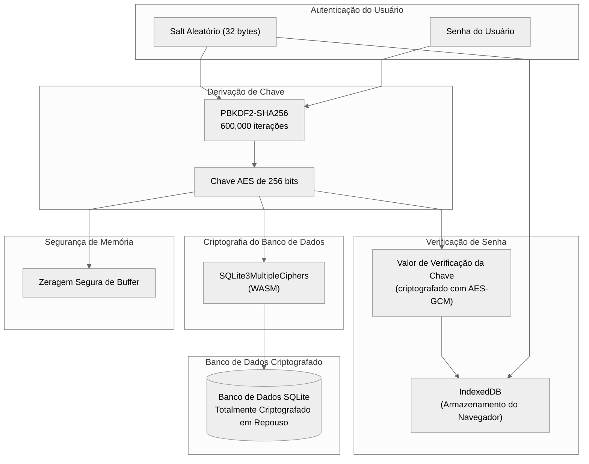
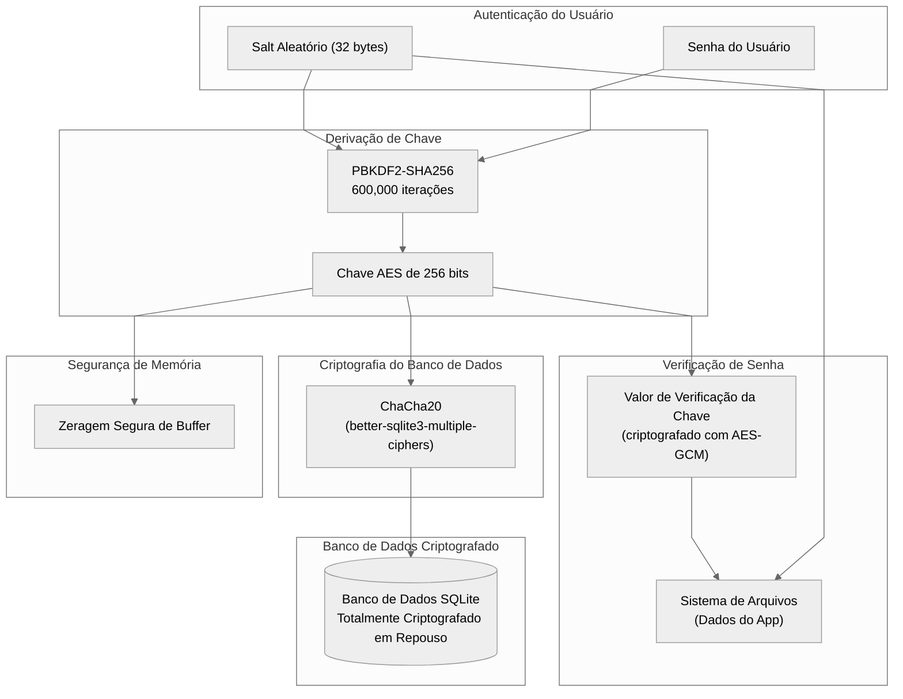
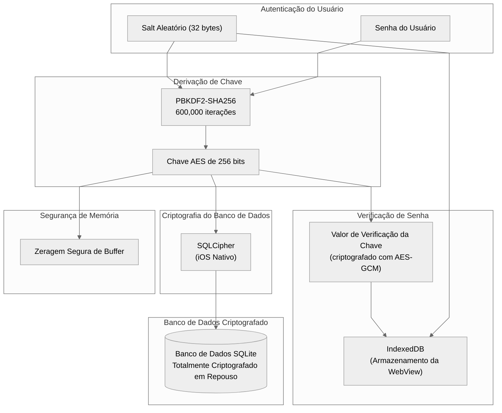

# Arquitetura de Criptografia do Banco de Dados

_Atualizado para refletir a versão em inglês de 11 de fevereiro de 2026._

## Web (Navegador)

## Electron (Desktop)

## iOS

## Android

## Referência de Plataforma

| Plataforma | Biblioteca de Criptografia | Armazenamento de Salt/KCV |
| --- | --- | --- |
| Web | SQLite3MultipleCiphers (WASM) | IndexedDB |
| Electron | ChaCha20 (better-sqlite3-multiple-ciphers) | Sistema de Arquivos |
| iOS | SQLCipher | IndexedDB (WebView) |
| Android | SQLCipher | IndexedDB (WebView) |
