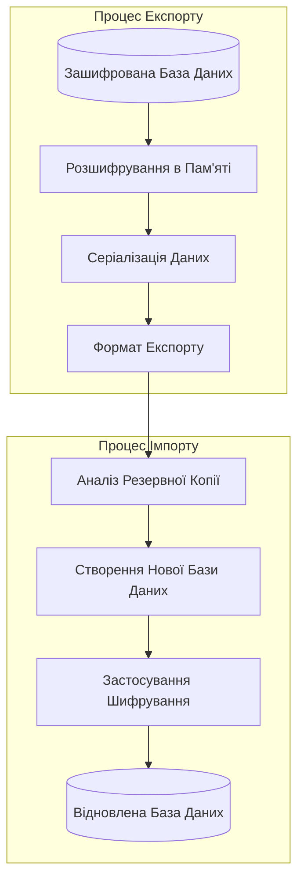
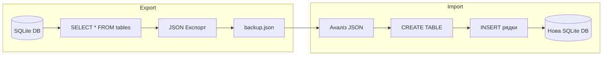
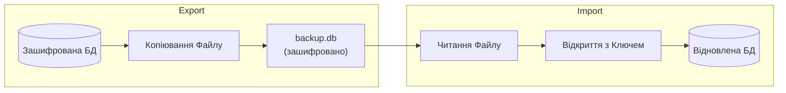
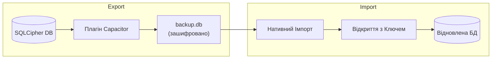

# Архітектура Резервного Копіювання та Відновлення

Rapid надає функціональність резервного копіювання та відновлення для захисту ваших даних. Через специфічні обмеження платформ із зашифрованими базами даних SQLite, формат резервного копіювання та процес відрізняються залежно від платформи.

## Огляд



## Web (Браузер/WASM)

### Проблема

SQLite3MultipleCiphers WASM має специфічні обмеження, що впливають на резервне копіювання/відновлення:

1. **`sqlite3_js_db_export()` повертає НЕЗАШИФРОВАНІ дані** - Функція серіалізує сторінки бази даних в пам'яті (розшифровані), а не зашифрований файл на диску
2. **`sqlite3_deserialize()` НЕ працює** - Повертає помилку `SQLITE_NOTADB` з цією збіркою WASM
3. **Emscripten FS недоступний** - Віртуальна файлова система не експонована

### Рішення: Резервне Копіювання на Основі JSON



### Формат Експорту

```json
{
  "version": 1,
  "tables": [
    { "name": "contacts", "sql": "CREATE TABLE contacts (...)" },
    { "name": "files", "sql": "CREATE TABLE files (...)" }
  ],
  "indexes": [
    { "name": "idx_contacts_email", "sql": "CREATE INDEX ..." }
  ],
  "data": {
    "contacts": [
      { "id": 1, "name": "John", "email": "john@example.com" },
      { "id": 2, "name": "Jane", "email": "jane@example.com" }
    ],
    "files": [...]
  }
}
```

### Міркування Безпеки для Web

- **Файли резервних копій НЕ зашифровані** - JSON експорт містить дані у відкритому тексті
- **Відповідальність користувача** - Користувачі повинні зберігати файли резервних копій безпечно
- **Повторне шифрування при імпорті** - Дані повторно шифруються при імпорті в нову базу даних
- **Жодного ключового матеріалу в резервній копії** - Ключі шифрування ніколи не включаються в резервні копії

## Electron (Десктоп)

Десктоп використовує нативний SQLite з better-sqlite3-multiple-ciphers, який підтримує стандартні механізми резервного копіювання SQLite.



### Міркування Безпеки для Electron

- **Файли резервних копій ЗАШИФРОВАНІ** - Резервна копія є копією зашифрованого файлу бази даних
- **Потрібен той самий ключ шифрування** - Потрібно використовувати той самий пароль для відновлення
- **Шифрування на рівні файлу збережено** - Все шифрування зберігається в резервній копії

## iOS та Android (Capacitor)

Мобільні платформи використовують SQLCipher через плагіни Capacitor.



### Міркування Безпеки для Мобільних

- **Файли резервних копій ЗАШИФРОВАНІ** - Використовує нативне шифрування SQLCipher
- **Потрібен той самий ключ шифрування** - Потрібно використовувати той самий пароль для відновлення
- **Нативна обробка файлів** - Використовує API файлів, специфічні для платформи

## Порівняння Платформ

| Характеристика | Web (WASM) | Electron | iOS/Android |
| -------------- | ---------- | -------- | ----------- |
| Формат Резервної Копії | JSON (відкритий текст) | Бінарний (зашифровано) | Бінарний (зашифровано) |
| Шифрування в Резервній Копії | Ні | Так | Так |
| Кросплатформне Відновлення | Так | Ні | Ні |
| Розширення Файлу | `.json` | `.db` | `.db` |
| Розмір Резервної Копії | Більший (текст) | Менший (бінарний) | Менший (бінарний) |

## Використання API

### WasmNodeAdapter (Web/Тестування)

```typescript
// Експорт в JSON
const jsonBackup = await adapter.exportDatabaseAsJson();

// Імпорт з JSON
await adapter.importDatabaseFromJson(jsonBackup, encryptionKey);
```

### ElectronAdapter (Десктоп)

```typescript
// Експорт (копіювання файлу)
const bytes = await adapter.exportDatabase();

// Імпорт
await adapter.importDatabase(bytes, encryptionKey);
```

## Відомі Обмеження

### Веб Платформа

- `sqlite3_deserialize()` повертає помилку `SQLITE_NOTADB`
- Бінарний імпорт не підтримується - потрібно використовувати формат JSON
- Резервні копії більші через текстове кодування JSON

### Всі Платформи

- Великі бази даних можуть мати проблеми з продуктивністю під час експорту
- Дані BLOB кодуються в base64 в JSON резервних копіях (збільшує розмір)
- Одночасні модифікації під час резервного копіювання можуть спричинити неузгодженості

## Найкращі Практики

1. **Закрийте базу даних перед резервним копіюванням** - Забезпечує узгодженість даних
2. **Зберігайте резервні копії безпечно** - Особливо для JSON резервних копій у відкритому тексті
3. **Періодично тестуйте відновлення** - Перевіряйте, що резервні копії дійсні
4. **Включіть резервне копіювання в рутину** - Регулярні резервні копії захищають від втрати даних
5. **Зберігайте пароль шифрування в безпеці** - Неможливо відновити без нього (для зашифрованих резервних копій)
