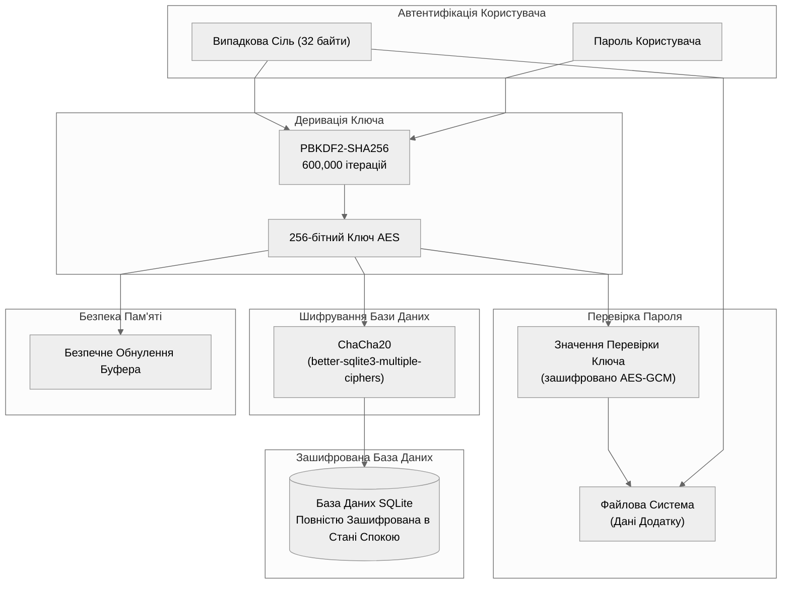
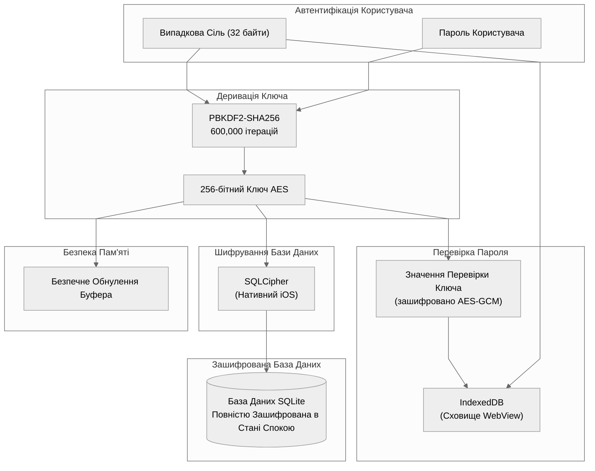

# Архітектура Шифрування Бази Даних

## Web (Браузер)

## Electron (Десктоп)

## iOS

## Android

## Довідник Платформ

| Платформа | Бібліотека Шифрування | Сховище Salt/KCV |
| --------- | --------------------- | ---------------- |
| Web | SQLite3MultipleCiphers (WASM) | IndexedDB |
| Electron | ChaCha20 (better-sqlite3-multiple-ciphers) | Файлова Система |
| iOS | SQLCipher | IndexedDB (WebView) |
| Android | SQLCipher | IndexedDB (WebView) |
